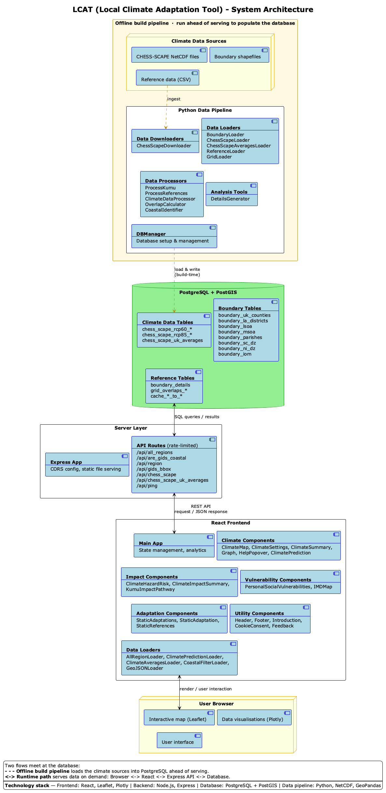

# LCAT - Local Climate Adaptation Tool

A tool for connecting together scientific information across climate,
health and policy in the UK. Access the latest [release here](https://lcat.uk/).

LCAT has been developed by the University of Exeter’s European Centre for Human Health, alongside stakeholders from Cornwall County Council, and other co-design partners from Local Government, the National Health Service, emergency services, and voluntary and private sectors. Previous partners include Then Try This, who developed previous iterations of the tool.

The tool is under continual development, with features, styling, and underlying data sets liable to change. Where possible, major changes will be signposted. Code previously developed for LCAT can be found in the archived repository [here](https://github.com/UniExeterRSE/LCAT-archived).

## Architecture overview

LCAT is composed of four main layers:

| Layer | Technology | Purpose |
|---|---|---|
| **Data pipeline** | Python, NetCDF, GeoPandas | Ingest CHESS-SCAPE climate data and boundary shapefiles into PostgreSQL |
| **Database** | PostgreSQL + PostGIS | Store climate projections, boundary geometries, and pre-computed overlaps |
| **API server** | Node.js / Express | Serve climate and boundary data to the frontend via a rate-limited REST API |
| **Frontend** | React, Leaflet, Plotly | Interactive map and data visualisations for end users |

A full component-level diagram is shown below (source: [lcat-architecture.puml](docs/software-architecture-diagrams/lcat-architecture.puml), rendered with [PlantUML](https://plantuml.com/) — see the [visualisation guide](docs/software-architecture-diagrams/visualisation-guide.md) to edit it):

  

## Installation & documentation

Please view the documentation [here](https://github.com/Uni-of-Exeter/research.LCAT.public/blob/main/docs/). A PDF guide to how LCAT works can be found [here](https://github.com/Uni-of-Exeter/research.LCAT.public/blob/autumn-clean-up/docs/files/lcat_data_pipeline_overview.pdf).

## License

- Development before 2024 Copyright © University of Exeter & Then Try This
- Development from 2024 Copyright © University of Exeter

This program is free software: you can redistribute it and/or modify
it under the terms of the Common Good Public License Beta 1.0 as
published [here](http://www.cgpl.org).

This program is distributed in the hope that it will be useful,
but WITHOUT ANY WARRANTY; without even the implied warranty of
MERCHANTABILITY or FITNESS FOR A PARTICULAR PURPOSE. See the
Common Good Public License Beta 1.0 for more details.

Boundary data for England, Wales, Scotland, and Northern Ireland are used in this tool:

- Source: Office for National Statistics licensed under the Open Government Licence v.3.0
- Contains OS data © Crown copyright and database right 2024

For more details, please view the sources document at [docs/4-sources.md](docs/4-sources.md).
